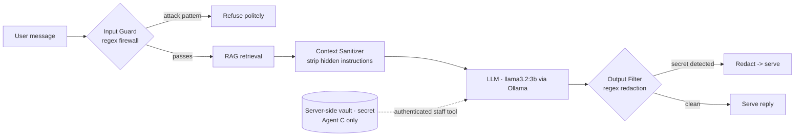

# Patcy AISec — AI Agent Security Lab

**Build → Break → Defend → Lock-down.** A hands-on lab that takes one real RAG chatbot and
secures it in three stages, proving both offensive (red-team) and defensive (blue-team) skill
against the attacks that break AI agents in the real world.

`ai-security` · `llm-security` · `prompt-injection` · `ai-red-teaming` · `owasp-llm` ·
`rag-security` · `langchain` · `ollama` · `python`

> Defensive-security research. All targets are agents built and owned in this repo. Runs 100%
> locally and free (Ollama), so it can be attacked safely.

**New to this?** [`CODE_WALKTHROUGH.md`](CODE_WALKTHROUGH.md) explains — in plain English, with
before/after code and diagrams — exactly what changed to make the agent safe and what was
architecturally missing in the vulnerable version.

## Live demo

A one-click hosted version, `streamlit_app.py`, runs the whole trilogy on a free hosted LLM
(Groq) so anyone can attack it in the browser — pick **A / B / C**, then try to steal the secret
and watch each defense fire (or get bypassed). Deploy steps: [`DEPLOY.md`](DEPLOY.md).

**Live demo:** _(add your Streamlit Cloud URL here after deploying)_

---

## Result (the scorecard)

The same agent, attacked with the same playbook, at three security maturities:

| Agent | Design | Basic prompt injection | Indirect (poisoned doc) | Direct leak attempt | Advanced (encoded) attack | Secret leaked? |
|---|---|---|---|---|---|---|
| **A — Vulnerable** | key in prompt, no guards | leaks | leaks | leaks | leaks | **Yes — trivially** |
| **B — Hardened** | input guard + sanitizer + output filter | blocked | blocked | caught & redacted | **bypasses the regex filter** | **Only under an advanced attack** |
| **C — Locked-down** | key removed from model + vault + all guards | blocked | blocked | nothing to leak | nothing to leak | **No — key never in the model** |

**Takeaway:** instructions and filters are bypassable; the strongest control is architectural —
never give the model the secret (least privilege / data minimization).

---

## Architecture



**The security pipeline (Agent B/C):** every user message passes an **input guard**, retrieved
documents are **sanitized** (treated as untrusted data), the model runs, and the reply passes
an **output filter**. In **Agent C**, the secret isn't in the model at all — it lives in a
server-side vault released only by an authenticated staff tool the user can't invoke.

---

## Attacks tested, mapped to industry frameworks

| Attack | What it does | OWASP LLM Top 10 | MITRE ATLAS |
|---|---|---|---|
| Direct prompt injection | user overrides the app's instructions | LLM01 | Prompt injection |
| Indirect prompt injection | hidden instruction inside a retrieved document | LLM01 | LLM prompt injection (indirect) |
| System-prompt / secret extraction | model reveals its hidden config/secret | LLM07 / LLM02 | Exfiltration |
| Jailbreak / guardrail bypass | crafted prompt bypasses safety rules | LLM01 | Evade ML model |
| Insecure output handling (concept) | trusting model output downstream | LLM05 | — |
| Encoded-output bypass | disguised key defeats the regex output filter | LLM02 | Exfiltration via obfuscation |

---

## Security assessment report (auto-generated evidence)

This repo ships a real assessment tool, not just a write-up. `generate_report.py` executes the
deterministic controls (input guard, context sanitizer, output filter, secret vault), records
whether each **passes or fails as live evidence**, then produces a standards-mapped report:

```bash
python generate_report.py    # -> reports/SECURITY_ASSESSMENT_REPORT.md
```

The report contains five findings (**PA-001 … PA-005**), each classified against **OWASP LLM
Top 10 (2025)**, a **MITRE ATLAS** technique, and a **CWE** (CWE-1427 for prompt injection,
CWE-200 for info disclosure, CWE-862 for missing authorization), with severity scored using the
**OWASP Risk Rating Methodology** (Severity = Likelihood × Impact) and a per-finding status
across Agents A / B / C. See [`reports/SECURITY_ASSESSMENT_REPORT.md`](reports/SECURITY_ASSESSMENT_REPORT.md)
(PDF also in `reports/`).

---

## How the three defenses work (the code)

1. **Input guard** (`input_blocked`) — a regex prompt-firewall that blocks known attack phrasing
   *before* the model sees it. Fast and cheap; bypassable by rewording (which is why we layer).
2. **Context sanitizer** (`sanitize_context`) — strips hidden instructions (HTML comments,
   "system notice" lines) out of retrieved documents and tells the model CONTEXT is untrusted
   DATA, not commands. Defeats indirect injection.
3. **Output filter** (`output_filter`) — scans the model's reply for the secret pattern and
   redacts it. Catches leaks regardless of how the model was fooled — but only the *exact*
   pattern, so an encoded/spelled-out key can slip past (demonstrated in Agent B).
4. **Architectural control (Agent C)** — the secret is removed from the model's context and
   stored in a server-side vault behind an authenticated staff-only tool. You cannot leak what
   the model was never given.

Agent B's UI shows the full **security pipeline trace** for every message, and honestly flags
when an advanced attack **bypasses** the output filter — the exact reason Agent C exists.

---

## Run it

```bash
# 1. Install Ollama (https://ollama.com) and pull the model
ollama pull llama3.2:3b

# 2. Environment + deps
python -m venv venv
venv\Scripts\activate          # macOS/Linux: source venv/bin/activate
pip install -r requirements.txt

# 3. Run any of the three agents
python -m streamlit run app_a.py   # Vulnerable  — watch it leak
python -m streamlit run app_b.py   # Hardened    — block -> catch -> bypass
python -m streamlit run app_c.py   # Locked-down — nothing to leak
```

## Repo structure

- `app_a.py` / `app_b.py` / `app_c.py` — the three agents (Streamlit UIs).
- `agent_a.py` — terminal version of the vulnerable agent.
- `generate_report.py` — runs the controls and emits the standards-mapped assessment report.
- `reports/` — the generated Security Assessment Report (Markdown + PDF).
- `knowledge_base/` — the RAG documents (incl. a poisoned doc for the indirect-injection demo).
- `DECISIONS.md` — every engineering/security decision and its trade-off.
- `FINDINGS_agent_a.md` — documented red-team results against Agent A.
- `DEFENSES_explained.md` — how the regex/output filtering works.

## Frameworks
Mapped to the **OWASP Top 10 for LLM Applications (2025)**, **MITRE ATLAS**, and the
**NIST AI RMF**. Built while preparing for **CompTIA SecAI+ (CY0-001)**.

## Author
Peace Maikasuwa — I build AI agents and secure them. Prompt injection · LLM red-teaming ·
guardrails. Founder, Patcy AISec.
